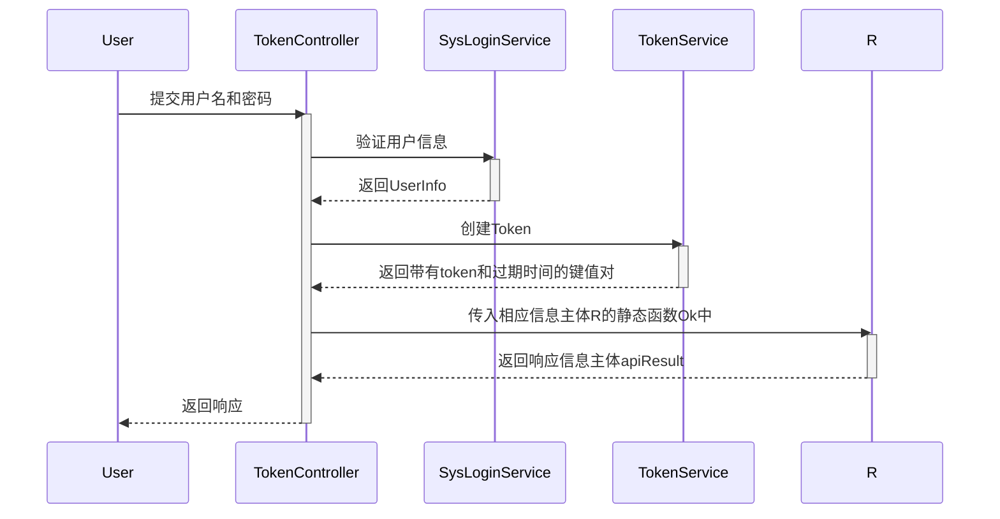
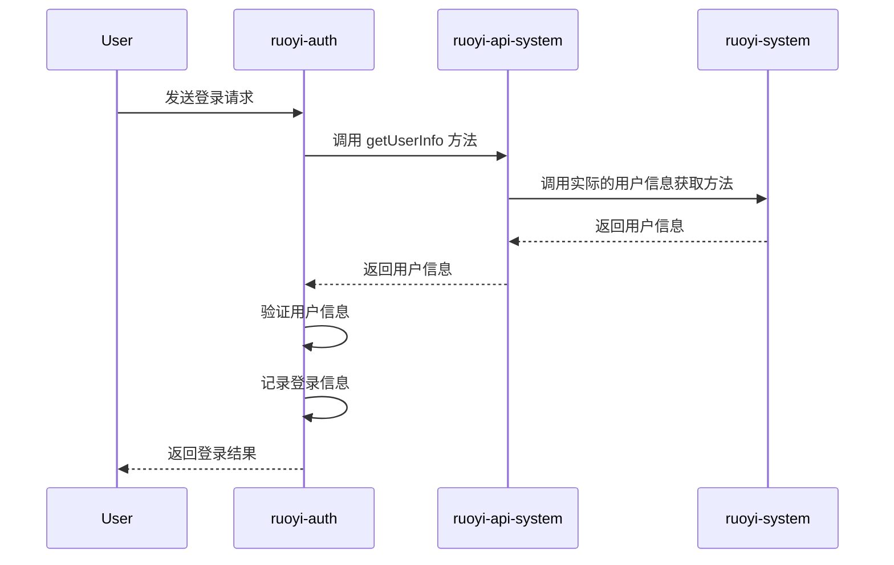

# RuoyiCloud 技术文档

这个文档面向我本人和其他想要了解若依框架微服务版本的业务流程的读者。 主要讨论系统管理，系统接口和权限等相关的逻辑。

## 代码框架

RuoYi-Cloud框架是微服务框架，框架自带基础模块，其中包含API，Authentication，Common, Gateway, modules和visual。

### Authentication

1.概述

认证模块主要负责用户身份验证和访问控制。 该模块提供用户登录，注销和JWT令牌等功能，确保只有经过身份验证的用户才能访问系统的受保护资源。

2.核心组件

· SysLoginService:负责处理用户登录，注销和注册等操作。

· TokenController:提供登录，注销，刷新令牌和注册等接口。

· CaptchaProperties：用于配置验证码相关的属性。

3.认证流程

- 用户登录： 用户通过TokenController的login接口提交用户名和密码。 SysLoginService 验证用户信息，如果验证通过，得到UserInfo, 然后调用tokenService类的createToken方法来创建Token，然后返回带有token和过期时间的键值对，这些键值对又传入相应信息主体R的静态函数Ok中，这个静态函数最后会返回一个响应信息主体apiResult，其中包含响应码，键值对和为null的msg。



- 用户注销：用户通过logout接口提交注销请求，SysLoginService记录用户注销日志，并删除用户的缓存记录。
- 令牌刷新：令牌的刷新位于拦截器的preHandle方法中，如果拦截器拦截的请求中token不为空，根据token找到对应的登录用户，如果登录用户不为空，判断token有没有过期，如果过期就刷新，更新登录用户的信息。这个流程基本涵盖了请求发出到响应的完整经过。大致的流程图如下：

  ```mermaid
    sequenceDiagram
    participant Client
    participant Gateway
    participant AuthFilter
    participant InnerAuthAspect
    participant PreAuthorizeAspect
    participant TargetService

    Client->>Gateway: 发起请求
    Gateway->>AuthFilter: 应用AuthFilter
    AuthFilter->>InnerAuthAspect: 验证内部请求
    InnerAuthAspect->>PreAuthorizeAspect: 执行授权决策
    PreAuthorizeAspect->>TargetService: 转发请求到目标服务
    TargetService-->>Gateway: 返回响应
    Gateway-->>Client: 返回响应
  ```
### 系统接口

在整个框架中，大致有两种接口，一种就是一般的Interface，用来给controller层提供服务。这种接口非常常见，不说了。另外一种接口就是@Feign注解的接口。接下来详细说一下@Feign注解在ruoyi-cloud中的使用。

1. 作用

在分布式微服务框架下，服务与服务之间可能会相互调用，Feign是声明式Web Service客户端，它让微服务调用变得更简单。

2. 机制

在ruoyi-auth模块下，SysLoginService服务提供了login方法用来处理若依系统的登录，在这个方法中又调用了ruoyi-system模块下的服务。但是login方法中并没有直接调用对应的方法，而是调用了ruoyi-api-system模块下的RemoteUserService接口中的getUserInfo方法。这是因为RemoteUserService是一个Feign客户端接口，login方法通过Feign客户端来远程调用ruoyi-system下的相关服务。 

3. 问题与细节

首先RemoteUserService作为FeignClient要加上注解@FeignClient，其次调用方(ruoyi-auth)和被调用方(ruoyi-system)的启动函数也要加上注解@EnableRyFeignClients。

在RemoteUserService接口中，被调用的方法名是getUserInfo，但是在ruoyi-system模块下的对应服务的方法名叫做info，这两个方法名不一样。实际上Feign客户端的方法名与被调用的方法名不一定要一模一样，因为只要请求路径是一样的，Feign就能自动找到对应的方法。


