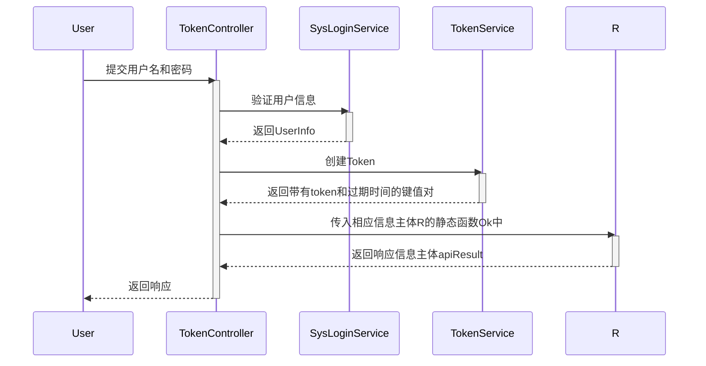
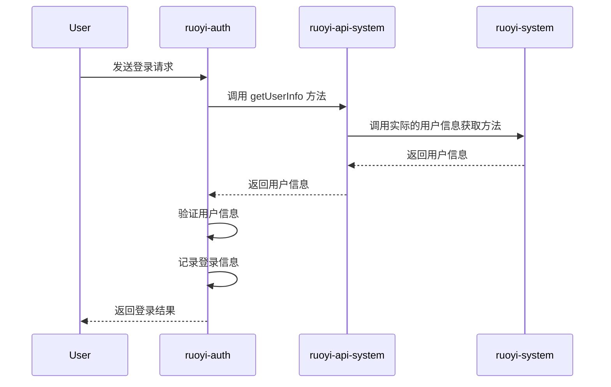
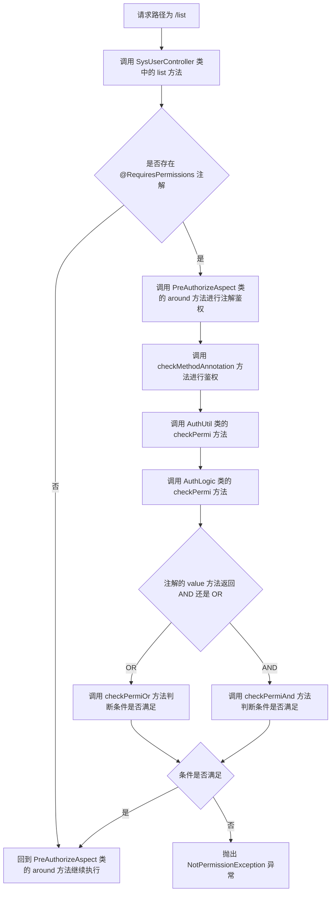
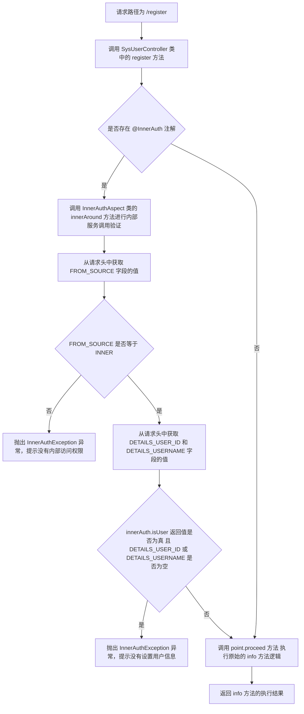
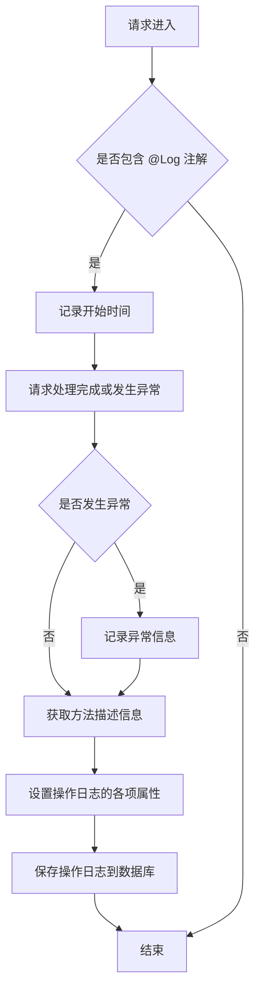
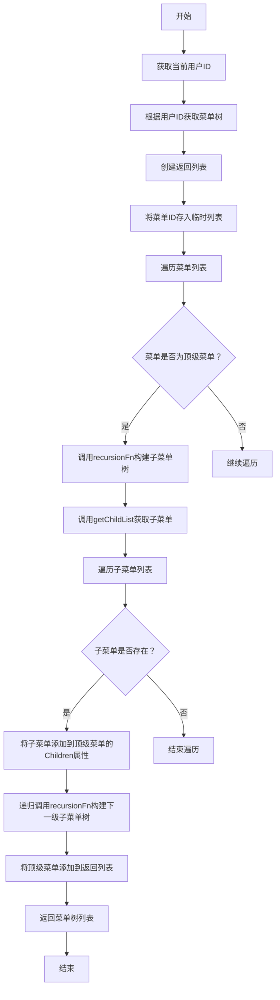

# RuoyiCloud 技术文档

这个文档面向我本人和其他想要了解若依框架微服务版本的业务流程的读者。 主要讨论系统管理，系统接口和权限等相关的逻辑。

## 代码框架

RuoYi-Cloud框架是微服务框架，框架自带基础模块，其中包含API，Authentication，Common, Gateway, modules和visual。

### Authentication

1.概述

认证模块主要负责用户身份验证和访问控制。 该模块提供用户登录，注销和JWT令牌等功能，确保只有经过身份验证的用户才能访问系统的受保护资源。

2.核心组件

· SysLoginService:负责处理用户登录，注销和注册等操作。

· TokenController:提供登录，注销，刷新令牌和注册等接口。

· CaptchaProperties：用于配置验证码相关的属性。

3.认证流程

- 用户登录： 用户通过TokenController的login接口提交用户名和密码。 SysLoginService 验证用户信息，如果验证通过，得到UserInfo, 然后调用tokenService类的createToken方法来创建Token，然后返回带有token和过期时间的键值对，这些键值对又传入相应信息主体R的静态函数Ok中，这个静态函数最后会返回一个响应信息主体apiResult，其中包含响应码，键值对和为null的msg。



- 用户注销：用户通过logout接口提交注销请求，SysLoginService记录用户注销日志，并删除用户的缓存记录。
- 令牌刷新：令牌的刷新位于拦截器的preHandle方法中，如果拦截器拦截的请求中token不为空，根据token找到对应的登录用户，如果登录用户不为空，判断token有没有过期，如果过期就刷新，更新登录用户的信息。这个流程基本涵盖了请求发出到响应的完整经过。大致的流程图如下：

  ```mermaid
    sequenceDiagram
    participant Client
    participant Gateway
    participant AuthFilter
    participant InnerAuthAspect
    participant PreAuthorizeAspect
    participant TargetService

    Client->>Gateway: 发起请求
    Gateway->>AuthFilter: 应用AuthFilter
    AuthFilter->>InnerAuthAspect: 验证内部请求
    InnerAuthAspect->>PreAuthorizeAspect: 执行授权决策
    PreAuthorizeAspect->>TargetService: 转发请求到目标服务
    TargetService-->>Gateway: 返回响应
    Gateway-->>Client: 返回响应
  ```
### 系统接口

在整个框架中，大致有两种接口，一种就是一般的Interface，用来给controller层提供服务。这种接口非常常见，不说了。另外一种接口就是@Feign注解的接口。接下来详细说一下@Feign注解在ruoyi-cloud中的使用。

1. 作用

在分布式微服务框架下，服务与服务之间可能会相互调用，Feign是声明式Web Service客户端，它让微服务调用变得更简单。

2. 机制

在ruoyi-auth模块下，SysLoginService服务提供了login方法用来处理若依系统的登录，在这个方法中又调用了ruoyi-system模块下的服务。但是login方法中并没有直接调用对应的方法，而是调用了ruoyi-api-system模块下的RemoteUserService接口中的getUserInfo方法。这是因为RemoteUserService是一个Feign客户端接口，login方法通过Feign客户端来远程调用ruoyi-system下的相关服务。 

3. 问题与细节

首先RemoteUserService作为FeignClient要加上注解@FeignClient，其次调用方(ruoyi-auth)和被调用方(ruoyi-system)的启动函数也要加上注解@EnableRyFeignClients。

在RemoteUserService接口中，被调用的方法名是getUserInfo，但是在ruoyi-system模块下的对应服务的方法名叫做info，这两个方法名不一样。实际上Feign客户端的方法名与被调用的方法名不一定要一模一样，因为只要请求路径是一样的，Feign就能自动找到对应的方法。


## RuoYi-Cloud框架对用户的相关操作

上述的内容中也包含了与用户(User)相关的一些技术细节，但是都是用User来举例说明其他细节。接下来详细讨论一下User在ruoyi-cloud下是如何工作的。

框架对User的处理主要在ruoyi-system模块下，从数据层到业务层的顺序，相关文件依次是：SysUserMapper.xml, mapper包下的SysUserMapper接口，service包下的ISysUserService接口和其实现类。 在xml文件中是SQL语句，MyBatis基于这些SQL语句与Mapper接口进行映射来实现对数据库的操作。service包下的接口和其实现类没什么特别的。

在Controller层，会发现有些注解比较有意思: @RequiresPermissions，@InnerAuth   这两个注解是自定义注解，下面看看它们的实现：

- @RequiresPermissions

  这个注解有两个注解：@Retention和@Target， 第一个注解表示@RequirePermissions注解的生命周期为运行时，这表明注解的信息在运行时是可用的，可以被反射机制读取和使用。 第二个注解表示@RequirePermissions注解可以应用于方法或类。

  @RequirePermissions注解包含两个属性： value(),logical()   第一个属性是一个字符串数组，代表了需要校验的权限，例如"system:user:list"，表示查看用户列表的权限。有些情况下，value()数组的权限码可能不止一个，所以需要第二个属性logical()来定义不同权限之间需要满足的逻辑关系，例如，Logical.AND说明如果一个方法被标记为@RequiresPermissions({"system:user:list", "system:user:add"})，那么只有同时具备 "system:user:list" 和 "system:user:add" 权限的用户才能访问这个方法。



- @InnerAuth
  @InnerAuth注解也是自定义注解，它还是切面类InnerAuthAspect的检查对象，具体检查过程不再分析，下面展示检查流程图。



- @Log
  @Log也是一个自定义注解，下面是该注解的执行流程

以上内容基本上就是ruoyi-cloud框架对User的一些操作和具体细节，透过User对象的list和register方法，分析了框架通过AOP和注解对权限的控制。接下来探究一下框架对菜单Menu的操作。

当点击系统管理下的菜单管理时，会以层状结构显示出当前系统的所有菜单信息。 虽然页面上显示的是层状的，但是在后端数据中，父菜单与子菜单之间的关系是树状的。当请求url为system/menu/list的时候，根据当前正在使用系统的用户的权限来返回对应的menu类型的列表。此时列表中的menu之间是没有关系的，如果想要在前端展示出逻辑关系，需要为这些menu创建树型关系，也就是请求url为/treeselect的方法treeselect()。

接下来探究一下，如何在menu之间建立树型关系。

treeselect()被调用后，首先获得当前用户权限下的所有menus，并将其存放在列表中。之后调用buildMenuTreeSelect()方法，在这个方法中又调用了buildMenuTree()方法，传入参数为含有所有menus的列表。 在buildMenuTree方法中，首先创建了一个返回列表用来返回创建好树型关系之后的menus，之后将menus的Id单独存放到列表tempList中，之后使用迭代器遍历menus中的每个menu，如果当前迭代的menu的ParentId不在tempList内，说明当前的menu是最顶级的菜单项(系统管理，系统监控，系统工具，若依官网)。为了判断以上内容的准确性，通过Navicat来观察
sys_menu表


图片中作为顶级菜单项的菜单的menu_id分别是1，2，3，4， 他们的parentId都是0。 因此通过判断tempList中是否包含当前menu的ParentId可以筛选出顶级菜单。 

找到顶级菜单后， 调用recursionFn()，这个方法的传入参数为所有的menus和当前迭代得到的顶级菜单。 在recursionFn()中，调用getChildList(), 传入参数与recursionFn()一致。 在getChildList()中， 首先创建一个数组列表，用来返回当前顶级菜单所有的子菜单， 之后使用迭代器，迭代所有的menus，判断当前迭代的menu的ParentId与当前的顶级菜单的Id是否相同，如果相同，说明当前menu是当前顶级菜单的子菜单，将其添加到数组列表中。getChildList()执行完毕后，就获得了当前顶级菜单的所有子菜单，然后更新顶级菜单的Children属性。但是观察若依官网会发现，顶级菜单的子菜单下还可能会分层，所以还要依次构建所有menus之间树型关系，因此通过递归调用recursionFn来实现。 递归完成后，所有menus的Children都会得到正确的设置， 这样一来，所有menus的树型结构就被创建起来了。 回到buildMenuTree()，递归方法结束后，将顶级菜单加入了之前创建好的返回列表中，最后返回这个返回列表到controller层。


在若依网页界面的左侧是菜单路由，这一部分的信息是由请求url"getRouters"获得的。 服务层的对应的方法是buildMenus()。 它的逻辑并不复杂，不再详细分析。


